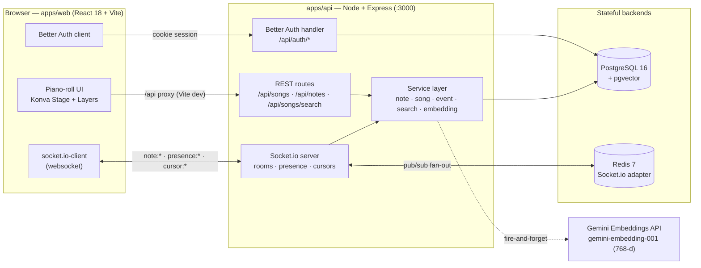
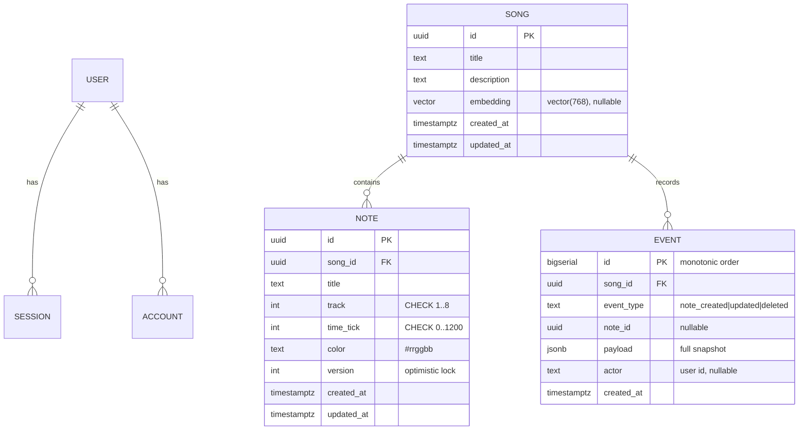
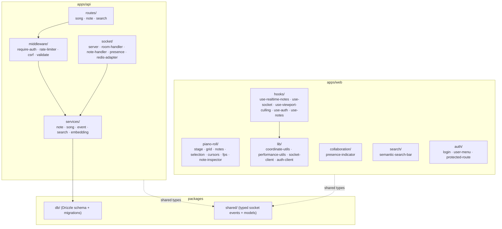
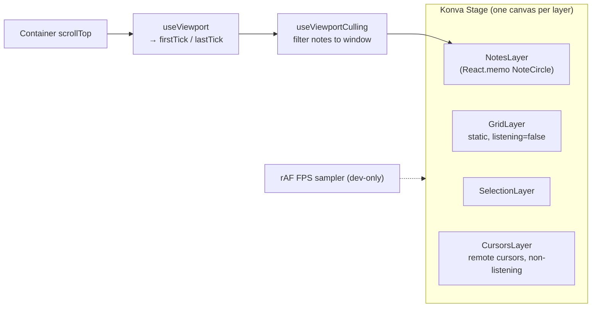
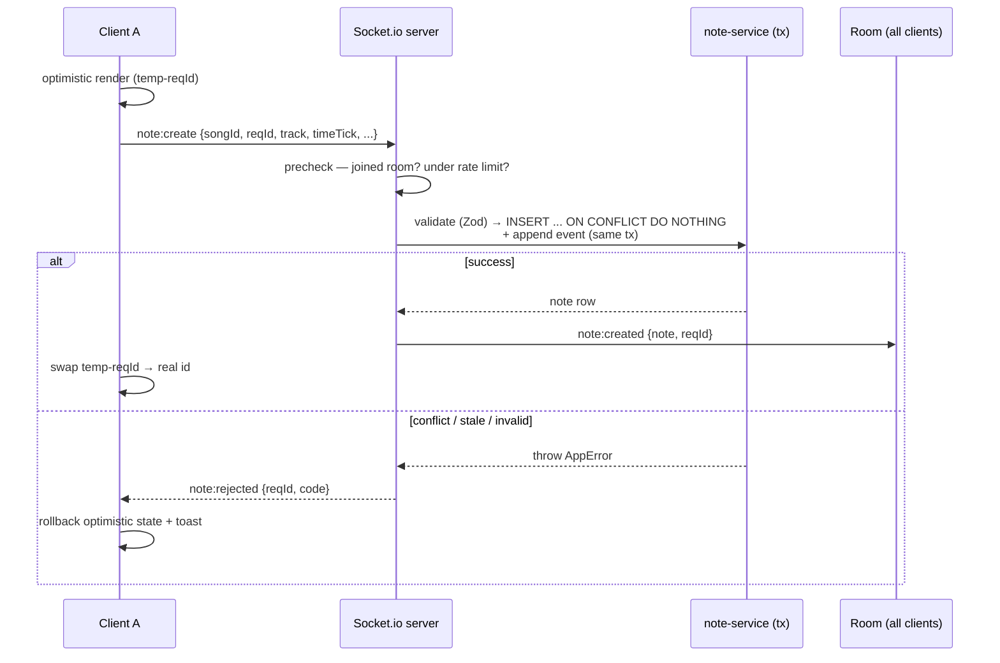

# AMA-MIDI Architecture

Diagram-first overview of the system. For phase-by-phase implementation detail see
[`system-architecture.md`](./system-architecture.md); for design rationale see
[`trade-offs.md`](./trade-offs.md).

## System Overview

The API and WebSocket share one HTTP server/port. REST and Socket.io mutations flow through
the **same service layer**, so every data-integrity guarantee (atomic cell upsert, optimistic
locking, atomic event append) holds regardless of transport.

## Data Model (ER)

Integrity invariant: **`UNIQUE(song_id, track, time_tick)`** — at most one note per grid cell.
Auth tables (`user`, `session`, `account`, `verification`) are owned by Better Auth (Kysely).

## Component Layout

## Canvas Rendering Pipeline

Culling keeps the live Konva node count bounded to the visible tick window, so a 10k-note song
renders with the same per-frame cost as a small one. Vertical zoom is a single `pixelsPerTick`
(2..8) parameter driving all coordinate math.

## Real-Time Note Flow

Presence (`join-song` → `presence:update`) and live cursors (`cursor:move` → volatile
`cursor:update`) ride the same connection; cursors are ephemeral (never persisted, dropped
under load rather than buffered).

## Cross-Node Scaling

Socket.io uses the Redis adapter so `io.to(room).emit(...)` fans out across API instances via
Redis pub/sub. The adapter attaches best-effort and falls back to the in-memory adapter if Redis
is unavailable (single-node still fully functional).
