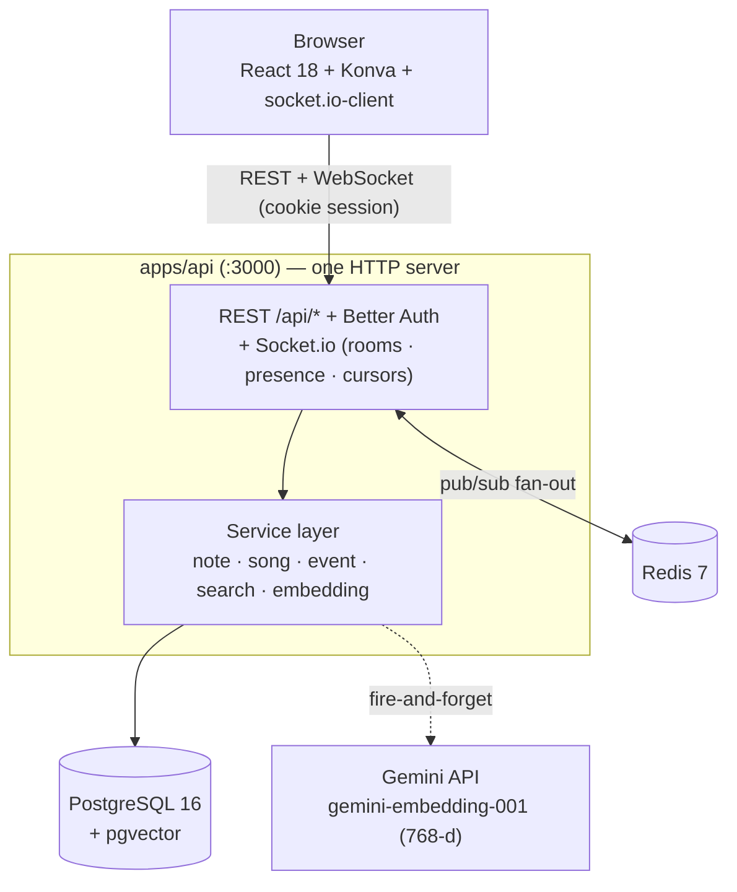
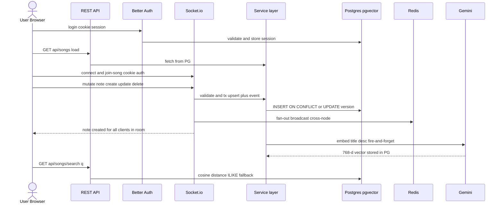
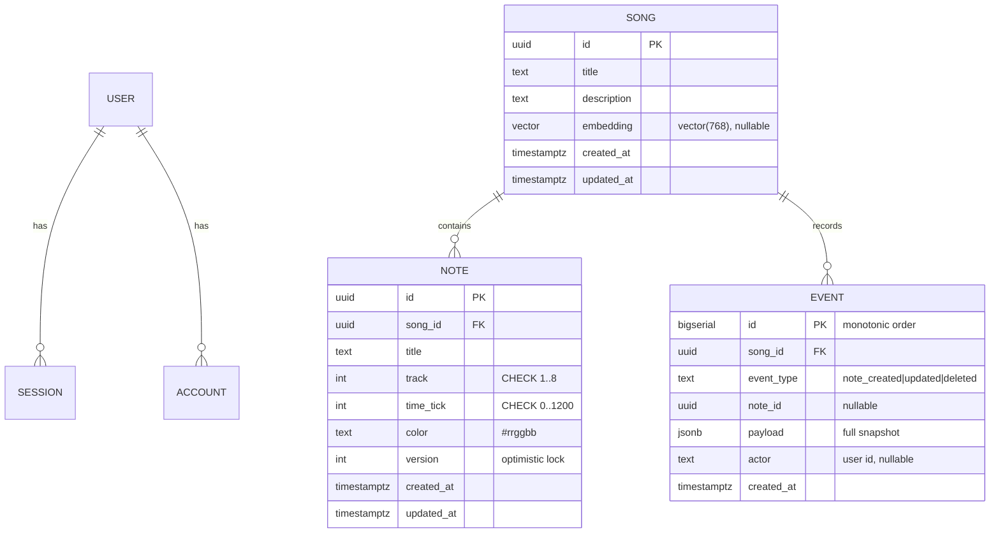
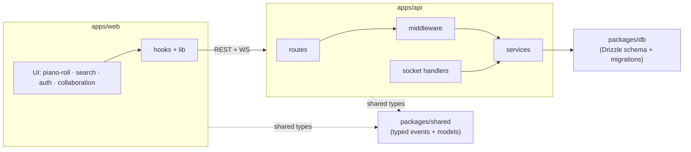
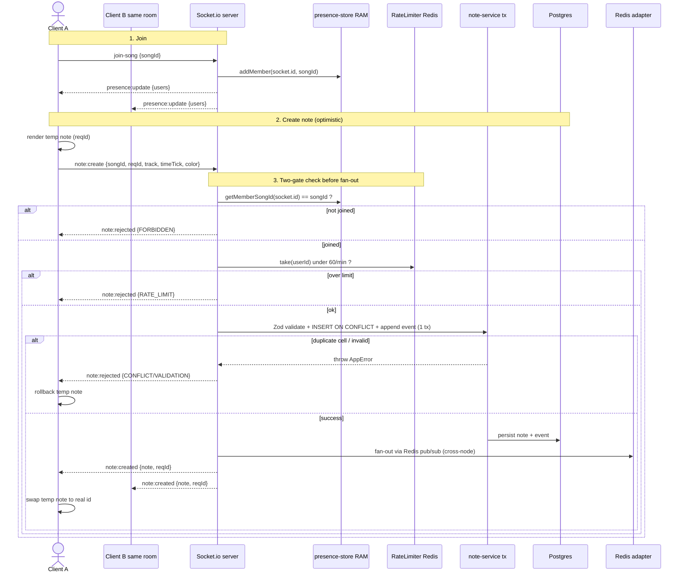
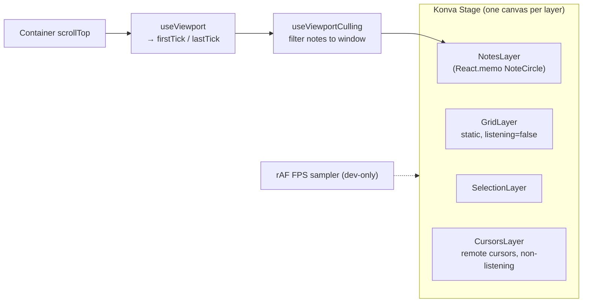
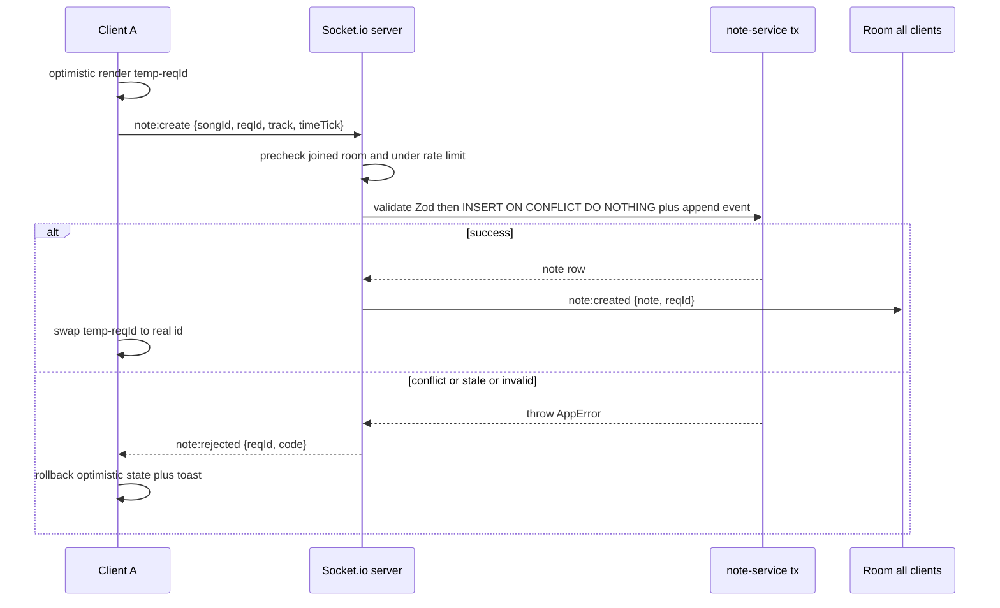
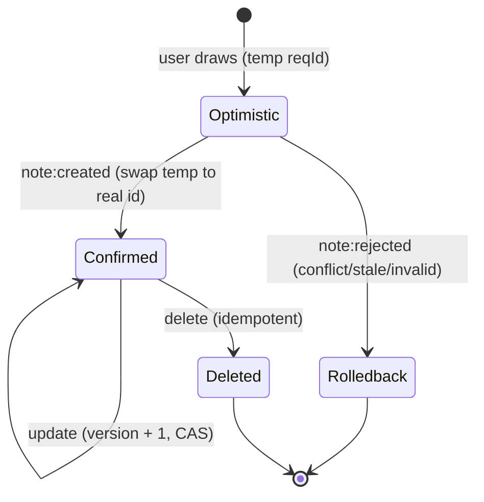

# AMA-MIDI Architecture

Diagram-first overview of the system. For phase-by-phase implementation detail see
[`system-architecture.md`](./system-architecture.md); for design rationale see
[`trade-offs.md`](./trade-offs.md).

## System Overview

Two views: a **structure** map (what talks to what) and an **end-to-end sequence**
(how a session actually flows over time).

### Structure (who connects to whom)



### End-to-end sequence (over time)



The API and WebSocket share one HTTP server/port. REST and Socket.io mutations flow through
the **same service layer**, so every data-integrity guarantee (atomic cell upsert, optimistic
locking, atomic event append) holds regardless of transport.

## Data Model (ER)



Integrity invariant: **`UNIQUE(song_id, track, time_tick)`** — at most one note per grid cell.
Auth tables (`user`, `session`, `account`, `verification`) are owned by Better Auth (Kysely).

## Component Layout

Read this as a **dependency chain** (left → right), not a wiring diagram:



Folder detail: `web` = `piano-roll/` (stage·grid·notes·selection·cursors·fps·note-inspector),
`hooks/` (use-realtime-notes·use-socket·use-viewport-culling·use-auth), `lib/`
(coordinate-utils·socket-client·auth-client). `api` = `routes/`, `middleware/`
(require-auth·rate-limiter·csrf·validate), `services/`, `socket/`
(server·room-handler·note-handler·presence·redis-adapter).

## API & Socket Contracts

The complete request/response surface: which REST path, what body struct goes up,
what socket event carries what data, and the two-gate check before every fan-out.

### REST endpoints (path · body · response)

Every `/api/*` route runs the same chain: `requireAuth` (cookie session) →
`rateLimiter` (Redis-backed) → `router` (Zod validate → service → Postgres).

| Method + Path | Body struct | Response |
| --- | --- | --- |
| `GET /health` | — | `{ ok: true }` |
| `GET /api/songs` | — | `{ ok, data: Song[] }` |
| `GET /api/songs/:id` | — | `{ ok, data: Song }` |
| `POST /api/songs` | `createSongSchema` | `201 { ok, data: Song }` |
| `PUT /api/songs/:id` | `updateSongSchema` | `{ ok, data: Song }` |
| `DELETE /api/songs/:id` | — | `204` |
| `GET /api/songs/:songId/notes` | — | `{ ok, data: Note[] }` |
| `POST /api/songs/:songId/notes` | `createNoteSchema` | `201 { ok, data: Note }` |
| `PUT /api/notes/:id` | `updateNoteSchema` | `{ ok, data: Note }` |
| `DELETE /api/notes/:id` | — | `204` |
| `GET /api/songs/search?q=` | query `q` | `{ ok, data: Song[] }` |
| `/api/auth/*` | Better Auth | cookie session |

Note body structs (Zod bounds mirror the DB CHECK constraints, defense-in-depth):

```
createNoteSchema = {
  title:       string 1..255      // required
  description?: string <=1000
  track:       int 1..8           // required (lane)
  timeTick:    int 0..1200        // required (time position)
  color?:      "#rrggbb"
}
updateNoteSchema = {
  title? description? track? timeTick? color?   // all optional
  version:     int >= 0           // REQUIRED → optimistic lock (reject stale writes)
}
```

### Socket events (name · payload)

```
Client → Server                          Server → Client (fanned out to the room)
join-song   {songId, name?}              presence:update {users: PresenceUser[]}
leave-song  {songId}                     cursor:update   {userId, name, color, track, timeTick}
note:create {songId, reqId, title,       cursor:leave    {userId}
             track, timeTick, color?}     note:created    {note, reqId}
note:update {songId, reqId, noteId,      note:updated    {note, reqId}
             version, track?, timeTick?,  note:deleted    {noteId, reqId}
             title?, description?, color?} note:rejected   {reqId, code, error}  (SENDER only)
note:delete {songId, reqId, noteId}
cursor:move {songId, track, timeTick}
```

`reqId` is a client-generated nonce: the sender renders an optimistic temp note, and
the server echoes `reqId` back on `note:created` so the sender can swap temp → real id.

### End-to-end + the fan-out gate



The **fan-out gate** (in `note-event-handler.ts` `precheck`) is two checks:
1. **Joined the room?** `getMemberSongId(socket.id) === songId` else `FORBIDDEN`
   (blocks editing an arbitrary song by guessing its UUID).
2. **Under rate limit?** `limiter.take(userId)` (60/min, keyed by user across tabs/nodes)
   else `RATE_LIMIT`.

Past both gates, the service transaction runs and `io.to(room).emit(...)` is the fan-out
point — the Redis adapter republishes to every API node via pub/sub, so Client B receives
the event even when connected to a different node.

## Canvas Rendering Pipeline



Culling keeps the live Konva node count bounded to the visible tick window, so a 10k-note song
renders with the same per-frame cost as a small one. Vertical zoom is a single `pixelsPerTick`
(2..8) parameter driving all coordinate math.

## Real-Time Note Flow



Presence (`join-song` → `presence:update`) and live cursors (`cursor:move` → volatile
`cursor:update`) ride the same connection; cursors are ephemeral (never persisted, dropped
under load rather than buffered).

## Note Lifecycle (state)



A note is rendered locally the instant a user draws it (Optimistic), then either promoted on the
server echo (Confirmed) or rolled back on `note:rejected`. Updates advance the `version` (optimistic
lock); deletes are idempotent and always win.

## Cross-Node Scaling

Socket.io uses the Redis adapter so `io.to(room).emit(...)` fans out across API instances via
Redis pub/sub. The adapter attaches best-effort and falls back to the in-memory adapter if Redis
is unavailable (single-node still fully functional).
