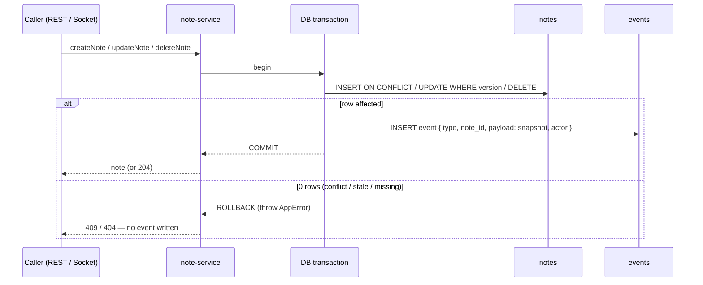

# Event Ledger

An **append-only** `events` table that records every note mutation. It gives the case study two
things a plain CRUD table can't: an **audit trail** (who changed what, when) and the **raw material
for undo/redo** — without the weight of full event sourcing. See the trade-off writeup in
[`trade-offs.md`](./trade-offs.md#5-history-lightweight-event-ledger-vs-full-cqrsevent-sourcing).

## Principle: never update, never delete

Rows are only ever **inserted**. Nothing mutates or removes an existing event, so the log is an
immutable history. Authoritative state still lives in the `notes` table; the ledger is the *story*
of how that state got there.

```
notes   → current truth   (mutable: INSERT / UPDATE / DELETE)
events  → history of truth (append-only: INSERT only)
```

## Schema

| Column | Type | Notes |
|--------|------|-------|
| `id` | `bigserial` PK | Monotonic — defines global replay order without UUID entropy |
| `song_id` | `uuid` FK → `songs` | `ON DELETE CASCADE`; events die with their song |
| `event_type` | `text` | `note_created` \| `note_updated` \| `note_deleted` |
| `note_id` | `uuid` (nullable) | The affected note (null reserved for song-level events) |
| `payload` | `jsonb` | **Full note snapshot** after the operation |
| `actor` | `text` (nullable) | User id from auth middleware (null = system/anonymous) |
| `created_at` | `timestamptz` | Defaults `now()` |

Index `idx_events_song_id_id` on `(song_id, id)` makes ordered per-song replay a single index scan.

## Atomicity: mutation + event in one transaction

The critical guarantee: the note change and its event row are written in the **same** `db.transaction`.
Either both land or neither does — the ledger can never drift from `notes`.



Because a rejected mutation throws **before** the commit, failed writes leave **no** event — the log
only ever contains operations that actually changed state.

## Event types & payloads

All three carry the post-operation note snapshot in `payload` (for delete, the snapshot of the row
as it existed just before removal, captured via `DELETE ... RETURNING`).

```jsonc
// note_created — the freshly inserted row
{
  "event_type": "note_created",
  "note_id": "8f1c…",
  "payload": { "id": "8f1c…", "songId": "…", "title": "C4", "track": 3,
               "timeTick": 120, "color": "#22d3ee", "version": 1, "createdAt": "…", "updatedAt": "…" },
  "actor": "user_abc"
}

// note_updated — snapshot AFTER the change (version already bumped)
{ "event_type": "note_updated", "note_id": "8f1c…",
  "payload": { …, "version": 2 }, "actor": "user_abc" }

// note_deleted — snapshot of the row that was removed
{ "event_type": "note_deleted", "note_id": "8f1c…",
  "payload": { …, "version": 2 }, "actor": "user_abc" }
```

## What it enables

**Audit trail** — `SELECT * FROM events WHERE song_id = $1 ORDER BY id` reconstructs the full timeline
of a song: every creation, edit, and deletion with its actor and timestamp.

**Undo / redo** — each event stores enough to compute its inverse:

| Forward event | Inverse action |
|---------------|----------------|
| `note_created` | delete the note (`note_id`) |
| `note_updated` | restore the previous snapshot (walk back one `note_updated`/`note_created` for that `note_id`) |
| `note_deleted` | re-insert `payload` |

Stepping the `id` cursor backward/forward over a song's events replays or reverts changes in order —
no separate snapshot store or projection engine required.

## Deliberately *not* built (YAGNI)

- **Replay-from-zero / read-model projections** — current state stays in `notes`; we never rebuild it
  from the log, so there's no projection or snapshot machinery (that's full CQRS/ES, out of scope).
- **Payload diffs** — storing the whole snapshot is simpler than a diff format and trivially invertible
  for these discrete grid cells. Storage cost is negligible at case-study scale (KISS).
- **Event compaction / retention** — the log grows unbounded by design here; a production system would
  add periodic snapshotting, noted as the scale-up path.
