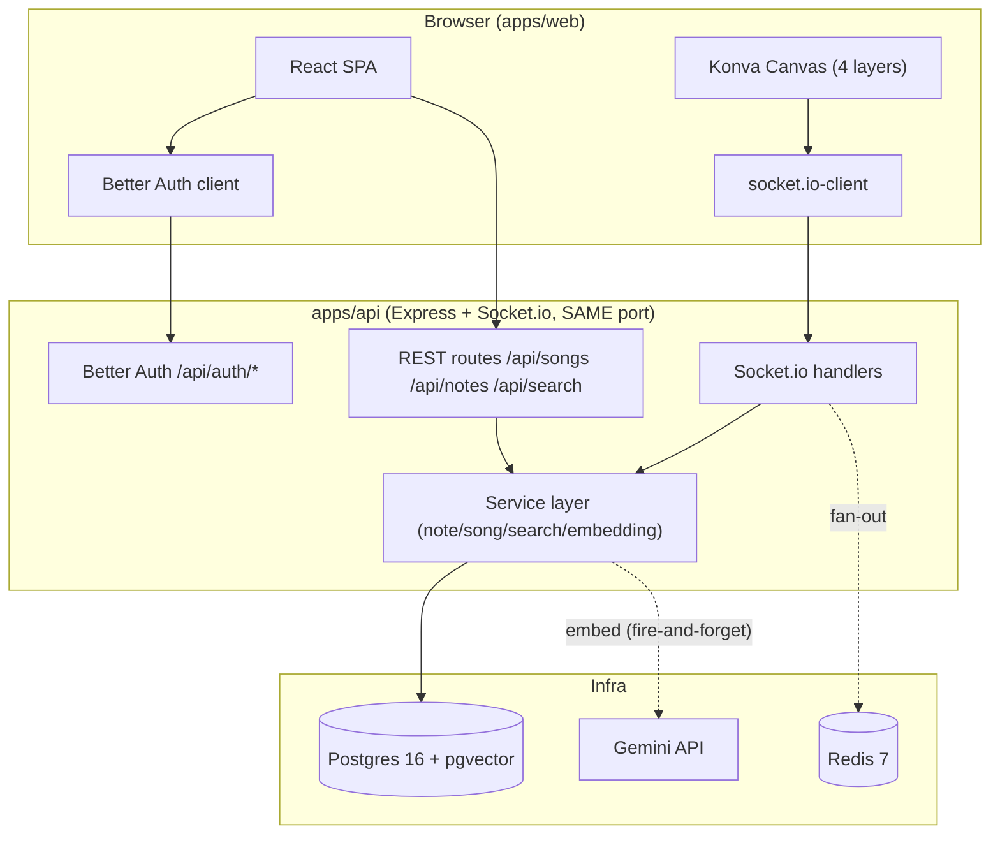
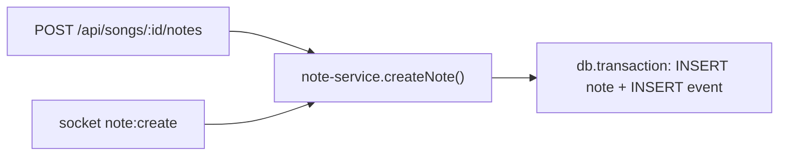
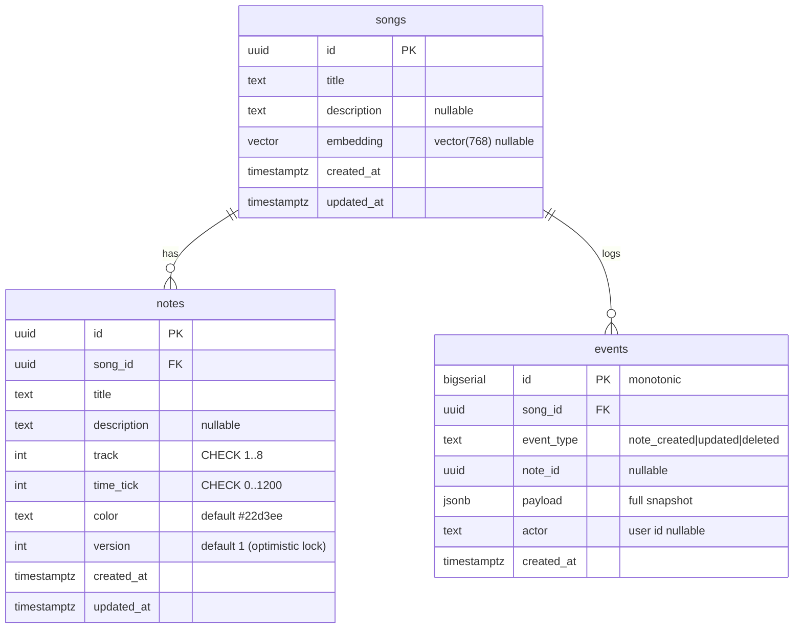
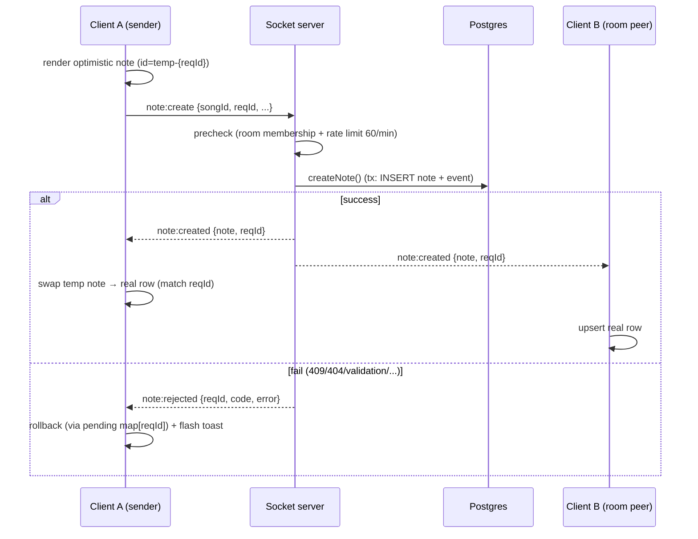
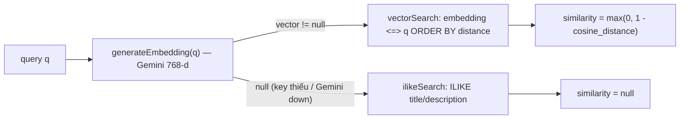
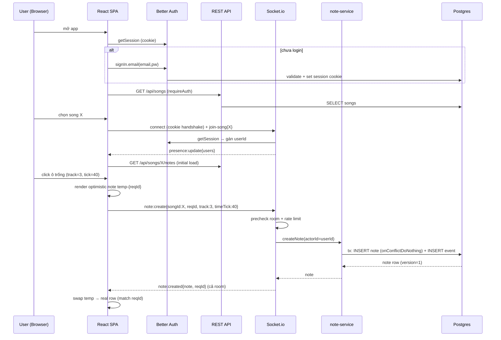

# AMA-MIDI — Learning Guide (Hướng dẫn học toàn hệ thống)

> Tài liệu **tự-chứa (self-contained)** để một developer học AMA-MIDI từ đầu đến cuối:
> Frontend → Backend → DevOps. Mọi mô tả đều **grounded** trong source code thật.
> Prose viết bằng **tiếng Việt**, technical terms giữ nguyên English.
>
> Tham chiếu chi tiết (DRY): [`architecture.md`](./architecture.md),
> [`trade-offs.md`](./trade-offs.md), [`api-reference.md`](./api-reference.md),
> [`event-ledger.md`](./event-ledger.md), [`system-architecture.md`](./system-architecture.md).

---

## 1. Tổng quan hệ thống

AMA-MIDI là một **collaborative piano-roll MIDI editor** (nhiều người sửa cùng lúc, real-time).
Người dùng đặt các "note block" lên một lưới (grid) 8 tracks × timeline 300 giây. Các thay đổi
được broadcast tức thời tới mọi người trong cùng "song room", có **presence** (ai đang online) và
**live cursors** (con trỏ của người khác). Ngoài ra có **semantic search** (tìm bài hát theo ngữ
nghĩa bằng AI embeddings) và **auth** đầy đủ (email/password + Google/GitHub OAuth).

### Tech stack

| Layer | Công nghệ | Vai trò |
|-------|-----------|---------|
| Frontend | React 18 + Vite + TypeScript | SPA |
| Canvas | Konva.js (`react-konva`) | Piano-roll grid rendering |
| Realtime client | `socket.io-client` | WebSocket, presence, cursors, note stream |
| Auth client | Better Auth (`better-auth/react`) | Session cookie |
| Backend | Express + TypeScript | REST API |
| Realtime server | Socket.io | Rooms, broadcast, cross-node fan-out |
| Auth server | Better Auth (Kysely + pg Pool) | Session, OAuth |
| DB | Postgres 16 + **pgvector** | Persistence + vector search |
| ORM | Drizzle ORM (`0.38.4` pinned) | Typed SQL, transactions |
| AI | Google Gemini `gemini-embedding-001` (768-d) | Embeddings cho search |
| Cache/PubSub | Redis 7 | Socket.io Redis adapter |
| Monorepo | pnpm@10.31.0 + Turborepo | Build orchestration |
| Test | Vitest, Playwright, k6 | Unit/integration/e2e/load |
| Deploy | Docker, Railway | CI/CD |

### Monorepo layout

```
ama-midi/
├── apps/
│   ├── web/        React 18 + Vite + Konva SPA
│   └── api/        Express + Socket.io server
├── packages/
│   ├── db/         Drizzle schema + migrations (Postgres/pgvector)
│   └── shared/     Types + constants + socket-event contracts (dùng chung web↔api)
├── e2e/            Playwright end-to-end tests
├── k6/             Load test scripts (note-creation, search)
├── docker-compose.yml         (dev: postgres + redis only)
├── docker-compose.prod.yml    (full containerised stack)
├── turbo.json / package.json  (root pnpm workspace + turbo tasks)
└── .github/workflows/ci.yml   (CI pipeline)
```

**Nguyên tắc cốt lõi:** `packages/shared` là **single source of truth** cho types (`Note`,
`PresenceUser`, `RemoteCursor`), constants (`TRACK_COUNT=8`, `MAX_TIME_TICK=1200`), và
**socket-event contracts** (`ClientToServerEvents` / `ServerToClientEvents`). Cả web lẫn api
import cùng file → không bao giờ lệch payload shape (DRY).

---

## 2. Kiến trúc tổng thể



### Shared-service-layer principle (điểm quan trọng nhất)

Cả **REST** (`note-routes.ts`) và **Socket.io** (`note-event-handler.ts`) đều gọi **cùng một hàm
service** (`createNote` / `updateNote` / `deleteNote` trong `note-service.ts`). Nghĩa là:

- Mọi guarantee về integrity (atomic upsert → 409, optimistic lock → 409, event ledger cùng
  transaction) áp dụng **giống hệt nhau** bất kể transport.
- Socket handler chỉ thêm 2 lớp gate (room membership + rate limit 60/min) rồi map error thành
  reject code, còn logic ghi DB thì **tái sử dụng nguyên vẹn**.



---

## 3. Data model

Ba bảng nghiệp vụ chính: `songs`, `notes`, `events` (+ 4 bảng của Better Auth:
`user/session/account/verification`).



### Invariants (từ `packages/db/src/schema/notes.ts`)

- `unique("uq_notes_song_track_tick").on(songId, track, timeTick)` — **không hai note nào chiếm
  cùng một ô grid**. Đây là hàng rào integrity số 1.
- `check("chk_notes_track", track BETWEEN 1 AND 8)`
- `check("chk_notes_time_tick", timeTick BETWEEN 0 AND 1200)`
- `index("idx_notes_song_id")` — query note theo song nhanh.
- `events`: `index("idx_events_song_id_id").on(songId, id)` — replay ledger theo thứ tự.

### Grid model & vì sao `time_tick` là INT không phải FLOAT

- 8 tracks (1..8). Timeline dùng **integer ticks** `0..1200`; **1 tick = 0.25s** → `1200 = 300s`
  (constants: `TRACK_COUNT`, `MAX_TIME_TICK`, `TICKS_PER_SECOND=4`).
- **INT thay vì FLOAT** vì: (1) grid rời rạc — mỗi ô là một vị trí xác định, snap-to-grid; (2)
  `UNIQUE(song_id, track, time_tick)` cần so sánh **bằng chính xác** — float có sai số làm hai
  giá trị "gần bằng" trở thành khác nhau, phá vỡ constraint; (3) INT rẻ để index và so sánh.

`SongDto = Omit<Song, "embedding">` — API không bao giờ trả vector 768-d nặng ra ngoài (chỉ
select `songColumns`).

---

## 4. Backend deep-dive

### 4.1 Express bootstrap order (CRITICAL) — `apps/api/src/index.ts`

Thứ tự middleware **có chủ đích**:

```
CORS(credentials:true, explicit origin)
  → Better Auth handler (/api/auth/*)   ← mount TRƯỚC express.json()
  → express.json()
  → csrfProtection
  → /health (public)
  → [requireAuth → rateLimiter → router]  cho /api/songs/search, /api/songs, /api/notes
  → errorHandler (cuối cùng)
```

Điểm cần nhớ:
- **Better Auth mount trước `express.json()`** vì BA đọc **raw body** nội bộ; nếu json parse
  trước sẽ hỏng.
- **`rateLimiter` chạy SAU `requireAuth`** để `req.user` đã có → key theo user id (100/15min),
  fallback IP (30/15min) chỉ dùng khi unauth lọt qua.
- **`/api/songs/search` mount TRƯỚC `/api/songs`** để chuỗi `search` không bị route `/:id` "nuốt".
- Socket.io + Redis chỉ được tạo khi `NODE_ENV !== "test"` (tránh leak handle trong integration
  test dùng supertest import `app`).

### 4.2 Middleware chain

| Middleware | File | Hành vi |
|-----------|------|---------|
| `requireAuth` | `require-auth.ts` | Gọi `auth.api.getSession()`; không session → 401 `UNAUTHORIZED`; gán `req.user`, `req.session`. |
| `rateLimiter` | `rate-limiter.ts` | `express-rate-limit`; auth 100/15min theo `user.id`, unauth 30/15min theo IP (`ipKeyGenerator`, IPv6-safe). Skip khi `NODE_ENV=test`. |
| `csrfProtection` | `csrf-protection.ts` | Chỉ chặn method mutating (POST/PUT/DELETE/PATCH); so `Origin`/`Referer` với trusted list (`localhost:5173`, `localhost:3000` + `WEB_ORIGIN`/`CORS_ORIGIN`); sai → 403. Skip khi test. |
| `validateBody(schema)` | `middleware/validate.ts` | Zod parse body; fail ném `ZodError` → 400. |

### 4.3 Service layer & transactions — `note-service.ts`

**Cả 3 mutation** đều bọc `mutation + recordEvent` trong **một `db.transaction`** → atomic
(all-or-nothing). Nếu ghi event fail thì note cũng rollback.

- **createNote**: `INSERT ... onConflictDoNothing().returning()`. Zero row nghĩa là ô đã bị chiếm
  → ném `ConflictError` (409). Không bao giờ ghi đè im lặng.
- **updateNote**: `UPDATE ... WHERE id AND version = expectedVersion`, set `version = expected+1`.
  Zero row → phân biệt: nếu note không tồn tại → `NotFoundError` (404); nếu tồn tại nhưng version
  khác → `ConflictError` (409, stale).
- **deleteNote**: `DELETE ... RETURNING`; zero row → 404.
- `actorId` (user id) được thread từ middleware xuống, ghi vào `events.actor`.

**song-service.ts**: create/update gọi `scheduleEmbedding()` **fire-and-forget** (`void (async…)`)
— lỗi bị nuốt/log, **không bao giờ crash** hay làm chậm request. Song mutation **KHÔNG** ghi event
(ledger chỉ scope cho note). `deleteSong` cascade xuống notes + events (FK `ON DELETE CASCADE`).

### 4.4 Event ledger — `event-service.ts`

Append-only: `recordEvent(tx, {...})` chỉ `INSERT`, không bao giờ UPDATE/DELETE. `id` là
`bigserial` → thứ tự monotonic không cần bookkeeping. Nhận `tx` handle để atomic với mutation.
Payload là **full snapshot** của note (đủ để replay undo/redo hoặc audit).

### 4.5 Error → HTTP code mapping — `error-handler.ts`

| Nguồn lỗi | HTTP | code |
|-----------|------|------|
| `ZodError` | 400 | `VALIDATION_ERROR` (kèm `flatten()`) |
| `AppError` (NotFound/Conflict) | `err.status` | `err.code` (404/409) |
| PG `23505` unique violation | 409 | `CONFLICT` (defense-in-depth) |
| PG `23514` check violation | 400 | `CHECK_VIOLATION` |
| PG `23503` FK violation | 404 | `NOT_FOUND` |
| Unknown | 500 | `INTERNAL_ERROR` (log, không leak internals) |

Envelope thống nhất: success `{ ok:true, data }`, error `{ ok:false, error, code }`.

### 4.6 REST routes (tóm tắt)

| Method + Path | Mô tả | Status |
|---------------|-------|--------|
| `GET /api/songs` | list (newest first, no embedding) | 200 |
| `POST /api/songs` | create | 201 |
| `GET /api/songs/:id` | detail | 200/404 |
| `PUT /api/songs/:id` | update | 200/404 |
| `DELETE /api/songs/:id` | delete (cascade) | 204 |
| `GET /api/songs/:songId/notes` | list notes (order track, tick) | 200 |
| `POST /api/songs/:songId/notes` | create note | 201/409 |
| `PUT /api/notes/:id` | update note (cần `version`) | 200/404/409 |
| `DELETE /api/notes/:id` | delete note | 204/404 |
| `GET /api/songs/search?q&limit` | semantic search (q 1-500, limit 1-50 def 10) | 200 |
| `GET /health` | public health | 200 |
| `/api/auth/*` | Better Auth (sign-up/in/out, session, callback) | — |

---

## 5. Real-time (Socket.io)

Socket.io **dùng chung port HTTP** với API (`createServer(app)` + `createSocketServer(httpServer)`),
transport **websocket-only** (bỏ qua HTTP long-polling handshake).

### 5.1 Handshake auth — `socket-server.ts`

`io.use()` middleware chạy khi kết nối: đọc cookie từ `socket.handshake.headers`, gọi
`auth.api.getSession()`. Không session → `next(new Error("UNAUTHORIZED"))` → từ chối connect.
Có session → gán `socket.data.userId`. Client gửi cookie qua `withCredentials: true`
(`socket-client.ts`).

### 5.2 Rooms & presence — `song-room-handler.ts` + `presence-store.ts`

- `join-song{songId, name}`: rời room cũ (mỗi socket 1 room), join `song:{id}`,
  `addMember`, broadcast `presence:update{users}` cho cả room.
- `leave-song`: rời room, `removeMember`, broadcast `cursor:leave` + presence.
- `disconnect`: cleanup tương tự.
- **presence-store là in-memory, process-local** — chỉ trả lời "ai đang ở room này TRÊN NODE
  NÀY". Đây là advisory UI state; dữ liệu note authoritative nằm ở Postgres. Mất presence khi
  restart node là vô hại.

### 5.3 Volatile cursors

`cursor:move{songId, track, timeTick}` → relay bằng `socket.volatile.to(room).emit("cursor:update")`.
**Volatile** = nếu client không kịp nhận thì **bỏ packet** thay vì buffer → tránh nghẽn dưới tải.
Cursor không bao giờ persist. Client throttle ~25fps (`CURSOR_THROTTLE_MS=40`).

### 5.4 Note mutation flow (optimistic UI + reqId reconciliation)



- **Server → client thành công**: broadcast `note:{created,updated,deleted}` cho **cả room** (kể
  cả sender). Mọi client hội tụ về row authoritative theo `id`.
- **Thất bại**: `note:rejected{reqId, code, error}` chỉ gửi **sender** → rollback + toast.
- Reject codes: `CONFLICT`, `NOT_FOUND`, `VALIDATION`, `FORBIDDEN`, `RATE_LIMIT`, `SERVER_ERROR`.
- Gate mutation (`precheck`): (1) phải là member của room target (chống sửa song bất kỳ bằng UUID)
  → `FORBIDDEN`; (2) rate limit 60/min per socket (sliding window in-memory) → `RATE_LIMIT`.

### 5.6 Note Inspector — Submit form UI + Optimistic lock hardening

**Note Inspector** (`piano-roll/note-inspector.tsx`) là form submit bên phải màn hình cho phép chỉnh
sửa một note được chọn. Năm trường editable: `title`, `description`, `track` (1-8), `timeTick`
(0-1200 tick), `color` (#rrggbb). Khi người dùng chỉnh đa trường một lúc rồi ấn Save, Inspector
draft local và commit **atomic** trong một `updateNote` socket event.

**Tại sao submit form thay vì inline edit:** Note detail là một record **coherent** (năm trường pháp
lệ). Draft locally rồi commit nguyên vẹn thay vì cập nhật từng trường, nhất là khi network latency
hoặc concurrent remote edits xảy ra.

**Hai cải tiến realtime conflict resolution:**

1. **Reject → Refetch reconcile (không stale snapshot)**: Khi server gửi `note:rejected`, thay vì
   restore optimistic state từ một stale snapshot, `useRealtimeNotes` giờ gọi `refetchNotes()` —
   re-pull authoritative note list từ server. Điều này tránh clobber edits của người khác (concurrent
   winner) đã broadcast được.

2. **Atomic lock via baseRef version**: Inspector capture version của note khi form load (snapshot
   vào `baseRef.current`), gửi kèm `version: baseRef.version` trong socket event. Server validate
   `UPDATE ... WHERE id AND version = expected`, nếu version khác (remote edit) → reject với 409.
   Form đồng thời warning banner (`remoteChanged=true`) nếu note version đổi giữa lúc người dùng
   đang edit.

**Behavior:**
- Form state bắt đầu từ `null` (no note selected). Click note trên grid → form load draft từ note
  data + snapshot `baseRef = note` (ghi version).
- Khi note thay đổi từ server (`note.version` đổi hoặc `note.id` mới):
  - Nếu form có unsaved edits → cảnh báo `remoteChanged` + "Cancel để load latest".
  - Nếu không có unsaved edits → adopt server state (reset draft), clear warning.
- Nút **Save** (enabled chỉ khi `dirty` — có field thay đổi): diff draft vs baseRef → gửi chỉ
  changed fields + `version: baseRef.version`.
- Nút **Cancel**: revert draft về baseRef, clear warning.
- Nút **Delete**: không dùng version (delete luôn win) → gọi `deleteNote(note.id)`.

Socket event cũng được refactor: `pending-ops` từ `Map[reqId] = {rollback, ...}` thành `Set<reqId>`
(đơn giản hơn, chỉ track "đang chờ"); `note:rejected` kích `refetchNotes()` không phải restore
snapshot cũ.

Server-side (`note-event-handler.ts`): `note:update` handler parse thêm `description` từ payload,
pass vào `updateNoteSchema.parse()` rồi `updateNote()` — cả REST lẫn Socket handler đều support.
`NoteUpdatePayload` (`socket-events.ts`) bổ sung `description?: string`.

### 5.7 Redis adapter — `redis-adapter.ts`

`attachRedisAdapter(io)` gọi bất đồng bộ (non-blocking). Nếu `REDIS_URL` unset hoặc connect fail
(`retryStrategy:null`, `connectTimeout:2000` → fail nhanh) → **fallback in-memory adapter**, never
throws. Có Redis → events broadcast trên node này reach clients trên node khác qua Pub/Sub
(horizontal scaling).

---

## 6. Frontend deep-dive

### 6.1 Cấu trúc React — `app.tsx`

`App` bọc `ProtectedRoute` → nếu chưa auth render `LoginPage`, nếu đang load render `null` (tránh
flash). `MainApp` compose các hook:
- `useAuth()` — Better Auth `useSession` + login/signup/logout/OAuth.
- `useSongs()` — list/select/create song qua REST.
- `useSocket(selectedSongId)` — connection + presence + cursors + `emitCursor`.
- `useRealtimeNotes(selectedSongId, socket)` — note state qua socket.

### 6.2 Konva 4-layer canvas — `piano-roll-stage.tsx`

Một `Stage` chứa 4 layer xếp chồng (mỗi layer = 1 `<canvas>` riêng):

| Layer | File | Đặc điểm |
|-------|------|----------|
| GridLayer | `grid-layer.tsx` | `listening={false}`, static — chỉ vẽ lại khi resize/zoom, **không** re-raster khi scroll (scroll là native DOM scroll của div cha). Cố ý **không** `layer.cache()` (bitmap tới ~9600px × retina tốn hàng trăm MB vô ích). |
| NotesLayer | `notes-layer.tsx` | `React.memo` `NoteCircle` → chỉ note thêm/xoá/selected re-render. Nhận **notes đã cull**. |
| SelectionLayer | `selection-layer.tsx` | Highlight note đang chọn. |
| CursorsLayer | `cursors-layer.tsx` | Remote cursors, non-listening. |

### 6.3 Viewport culling + coordinate math

- `useViewport(containerHeight, pixelsPerTick)`: từ `scrollTop` tính `firstTick`/`lastTick` (có
  pad ±4 tick chống pop-in).
- `useViewportCulling(notes, firstTick, lastTick)` → `cullNotes()` (O(n) filter theo `timeTick`).
  → **số Konva node luôn bị chặn** theo cửa sổ nhìn thấy, không phụ thuộc tổng số note ⇒ 10k note
  vẫn ~60fps.
- `coordinate-utils.ts` (pure functions): `toCanvasX/Y` (forward), `toTrack/toTick` (inverse,
  snap-to-grid + clamp). `pixelsPerTick` zoom trong khoảng **2..8** (`DEFAULT=4`).
- FPS sampler (`useFpsCounter`) + overlay chỉ chạy `import.meta.env.DEV` (grading/demo), không prod.

### 6.4 Optimistic state & reqId reconciliation — `use-realtime-notes.ts`

- Initial load notes qua **REST** (source of truth khi join).
- Mọi mutation: apply local ngay (optimistic) + emit socket event kèm `reqId` (uuid). Lưu
  `pending.current[reqId] = { rollback }`.
- `note:created` khớp `reqId` của mình → xoá temp note (`temp-{reqId}`), thêm real row. Của người
  khác → `upsert`.
- `note:updated/deleted` → clear pending + apply.
- `note:rejected` → gọi `rollback()` + `flash(message)`.
- `moveNote` gửi `version` hiện tại để server làm optimistic lock.

### 6.5 Socket hooks — `use-socket.ts` + `socket-client.ts`

Singleton socket (`getSocket()`, `autoConnect:false`, `reconnection:true`, `withCredentials:true`).
`useSocket` connect on mount, join room khi `songId` đổi, **auto-rejoin on reconnect**
(`socket.on("connect", join)`), prune cursor khi presence đổi, throttle `emitCursor`.

---

## 7. AI semantic search



- **Embedding** (`embedding-service.ts`): Gemini `gemini-embedding-001`, request
  `outputDimensionality: 768` để khớp `vector(768)`. Trả `null` khi key thiếu / API lỗi / shape
  sai → caller fallback graceful. Fire-and-forget: song create/update tự embed nền, lỗi bị nuốt.
- **Vector search** (`search-service.ts`): raw `pg` Pool (cho toán tử pgvector `<=>`), query
  parameterized (`$1::vector`, `$2`), `WHERE embedding IS NOT NULL ORDER BY distance LIMIT`.
  `similarity = max(0, 1 - cosine_distance)` (cosine distance ∈ [0,2]).
- **ILIKE fallback**: nếu Gemini không có embedding → `ILIKE '%'||$1||'%'` trên title+description,
  `similarity = null`. **Không bao giờ 500** vì thiếu AI.

---

## 8. Auth & Security

- **Better Auth** (`auth-config.ts`): dùng **pg Pool trực tiếp** (BA drive Kysely) để né peer-dep
  conflict với Drizzle adapter. Bảng: `user/session/account/verification`.
- **Cookie session** (không JWT): HttpOnly, `SameSite=Lax`, `Secure` khi production
  (`useSecureCookies`), prefix `ama-midi`, expiry **7 ngày**, refresh **daily** (`updateAge`).
- **Cookie cache DISABLED** (chủ đích): mỗi request validate DB → **logout revoke access ngay lập
  tức**. Không có "revocation gap" như signed snapshot trong cookie. Chi phí OK vì local Postgres +
  `requireAuth` đã chạy mỗi request.
- **CSRF**: check `Origin`/`Referer` với trusted origins trên mutating methods. BA tự lo CSRF cho
  `/api/auth/*`.
- **Rate limit**: REST 100/15min (auth) · 30/15min (IP); Socket 60/min per socket cho note mutation.
- **OAuth**: Google/GitHub chỉ bật khi có cả `CLIENT_ID` + `CLIENT_SECRET` (conditional, YAGNI).
- Cùng một cookie xác thực **cả REST lẫn Socket handshake** → không cần token scheme thứ hai (DRY).

---

## 9. DevOps & Deployment

### 9.1 Local dev

- `docker-compose.yml`: chỉ hạ tầng — `postgres` (`pgvector/pgvector:pg16`,
  `ama_midi_user/ama_midi_pass/ama_midi_db :5432`, healthcheck `pg_isready`) và
  `redis:7-alpine :6379`. API + web chạy ngoài Docker bằng `pnpm dev` (turbo, hot-reload).
- `.env`: `DATABASE_URL`, `REDIS_URL`, `PORT=3000`, `AUTH_SECRET`, `AUTH_URL`, `CORS_ORIGIN`,
  `WEB_ORIGIN`, `GOOGLE_/GITHUB_ CLIENT_ID/SECRET`, `GEMINI_API_KEY`, `VITE_API_URL`.

### 9.2 CI/CD — `.github/workflows/ci.yml`

Chạy trên mọi push/PR. Service container: postgres (pgvector) + redis. `NODE_ENV=test`
(skip rate-limit/CSRF). Env không có `GEMINI_API_KEY` → search test đi nhánh ILIKE.

```
checkout → setup Node 24 → corepack pnpm@10.31.0 → cache pnpm store + turbo
  → pnpm install --frozen-lockfile
  → typecheck → lint → build
  → npx tsx packages/db/src/migrate.ts   (run migrations)
  → pnpm test   (all workspaces, e2e filtered out ở root script)
```

Job `deploy` (scaffold, chỉ push→main): stub Railway CLI, cần thêm secret `RAILWAY_TOKEN` và
uncomment để active.

### 9.3 Docker build (multi-stage)

- **api Dockerfile**: builder `node:24-alpine` → `pnpm install` → `pnpm --filter @ama-midi/api build`
  → `--prod deploy /prod` (prune dev deps). Runtime stage copy `dist` + prod `node_modules` +
  drizzle migration files, chạy **non-root** (`appuser`), `HEALTHCHECK /health`, `CMD node dist/index.js`.
- **web Dockerfile**: builder build Vite SPA → stage `nginx:1.27-alpine` serve static + SPA
  fallback (`nginx.conf`), healthcheck `/index.html`.
- `docker-compose.prod.yml`: build cả api+web, postgres/redis internal-only (`expose`, có
  `requirepass`), api `depends_on` healthy postgres+redis.

### 9.4 Railway — `railway.json`

Builder `DOCKERFILE`, `startCommand: node dist/index.js`, `healthcheckPath: /health`,
restart `ON_FAILURE` (max 3). Railway cung cấp managed Postgres (pgvector) + Redis
(xem [`trade-offs.md`](./trade-offs.md) §6).

### 9.5 Turborepo — `turbo.json`

Tasks: `build` (`dependsOn ^build`, outputs `dist/**` `.next/**`), `dev` (không cache, persistent),
`lint`, `test` (`dependsOn ^build`), `typecheck`. Root override `drizzle-orm: 0.38.4`.

---

## 10. Luồng hoạt động đầu-cuối (end-to-end)

Kịch bản: user mở app → auth → chọn song → load notes → vẽ 1 note → broadcast → persist → log event.



Nếu ô đã bị chiếm: `INSERT` trả 0 row → `ConflictError` → `note:rejected{code:CONFLICT}` → client
rollback temp note + toast.

---

## 11. Testing strategy

Kim tự tháp test (Phase 10 done — xem `plans/.../phase-10-completion-260731-1113.md`):

| Tầng | Công cụ | Chứng minh điều gì |
|------|---------|--------------------|
| Unit | Vitest | Pure logic: `coordinate-utils` (42), `performance-utils` (10), `validators` (27). |
| Integration (real Postgres) | Vitest + pg thật | `crud-integrity` (14) — unique/optimistic-lock/event atomicity; `realtime` (6) — socket flow; `auth` (9); `search` (9, ILIKE fallback khi không có Gemini key). |
| E2E | Playwright | `auth-flow`, `boundary`, `conflict`, `realtime-sync` — hành vi thật trên browser. |
| Load | k6 | `note-creation-load.js`, `search-load.js` — throughput/latency. |

Điểm mạnh: integration test chạy trên **Postgres thật** (không mock) → xác nhận constraint DB thực
sự enforce (unique cell, CHECK, cascade), không phải giả lập.

---

## 12. Câu hỏi khó (Hard Q&A)

**Q1. Hai user click cùng 1 ô cùng lúc thì sao?**
`createNote` dùng `INSERT ... onConflictDoNothing().returning()`. Người thắng lấy được row; người
thua `INSERT` trả 0 row → `ConflictError` (409) → nhận `note:rejected{CONFLICT}` → rollback optimistic
note + toast. Không ghi đè, không mất dữ liệu. Bảo vệ bởi `UNIQUE(song_id, track, time_tick)`.

**Q2. Hai user cùng move một note đang tồn tại?**
Optimistic lock: `UPDATE ... WHERE id AND version = expectedVersion`, set `version+1`. Người đầu
thành công (version bump). Người sau gửi version cũ → 0 row → phân biệt 404 (note bị xoá) vs 409
(stale) → reject → rollback. "Lost update" không thể xảy ra.

**Q3. Vì sao optimistic lock chứ không CRDT?**
Note là **ô rời rạc** keyed `(song, track, tick)`. Hai người nhắm cùng ô là **conflict thật** nên
surface (409), không merge im lặng. CRDT giải bài toán free-form concurrent text mà ta không có →
overkill (complexity/memory). `UNIQUE` lo create-conflict, `version` lo update-conflict.
(xem `trade-offs.md` §3).

**Q4. Cookie cache disabled ảnh hưởng gì tới performance/security?**
Security: **logout revoke ngay** (mỗi request validate DB, không có gap). Performance: mỗi request
tốn 1 query session — chấp nhận được ở scale này (local PG, `requireAuth` đã chạy mỗi request).
Nếu bật cookie cache sẽ có "revocation gap": session đã xoá vẫn valid tới khi cache hết hạn.

**Q5. Làm sao render 10k note ~60fps?**
Viewport culling: `useViewport` tính cửa sổ tick nhìn thấy (±4 pad), `cullNotes` filter O(n) →
NotesLayer chỉ nhận note trong cửa sổ ⇒ số Konva node **bị chặn** bất kể tổng số note. Cộng thêm
`React.memo` NoteCircle (chỉ note thay đổi re-render) và GridLayer static (không re-raster khi scroll,
native DOM scroll). Không cần WebGL/PixiJS.

**Q6. Nếu Gemini down thì search ra sao?**
`generateEmbedding` trả `null` (bọc try/catch) → `searchSongs` đi nhánh `ilikeSearch`
(`ILIKE` trên title/description, `similarity=null`). **Không 500**. Ngoài ra, embedding song là
fire-and-forget nên Gemini down cũng không chặn create/update song.

**Q7. Vì sao event ledger + mutation cùng một transaction?**
Để **atomic audit**: nếu ghi event fail thì mutation note cũng rollback, và ngược lại. Không thể có
tình trạng "note đã đổi nhưng ledger thiếu record" (hoặc thừa record cho mutation không xảy ra).
`recordEvent(tx, …)` nhận cùng `tx` handle với `INSERT/UPDATE/DELETE` note.

**Q8. Socket và REST khác nhau chỗ nào về integrity?**
**Không khác** về integrity — cả hai gọi cùng `note-service`. Socket chỉ thêm 2 gate (room
membership → `FORBIDDEN`, rate 60/min → `RATE_LIMIT`) và map error thành reject code. Toàn bộ
atomic upsert / optimistic lock / event ledger giống hệt. Đây là "shared-service-layer principle".

**Q9. Redis chết thì realtime còn chạy không?**
Còn. `attachRedisAdapter` fail-fast (retryStrategy null, timeout 2s) → **fallback in-memory adapter**,
never throws. Single node vẫn broadcast bình thường. Chỉ **cross-node fan-out** mất (client ở node
khác không nhận được) — nhưng ở single node thì không ảnh hưởng.

**Q10. Vì sao `time_tick` là INT?**
Grid rời rạc + snap-to-grid; `UNIQUE(song, track, tick)` cần so sánh **bằng chính xác** (float có
sai số phá constraint); INT rẻ để index/compare. 1 tick = 0.25s, 0..1200 = 0..300s.

**Q11. `reqId` để làm gì?**
Là nonce client sinh cho mỗi mutation. Server echo lại trong `note:{created,updated,deleted,rejected}`.
Client dùng nó để **reconcile**: khớp temp note (`temp-{reqId}`) với real row khi thành công, hoặc
gọi `rollback` từ `pending[reqId]` khi bị reject. Không có reqId thì không biết echo nào ứng với
optimistic op nào.

**Q12. Vì sao Better Auth mount trước `express.json()`?**
BA đọc **raw body** nội bộ; nếu `express.json()` đã consume/parse stream trước thì BA hỏng. Nên
`app.all("/api/auth/*", toNodeHandler(auth))` đặt trước `app.use(express.json())`.

**Q13. Làm sao chống user sửa song họ không mở?**
Socket `precheck` yêu cầu `getMemberSongId(socket.id) === payload.songId` — phải join room trước
mới edit được → không thể bắn note:create tới songId bất kỳ bằng UUID. Sai → `FORBIDDEN`.

**Q14. Cursor bị mất packet dưới tải nặng có sao không?**
Không sao — cursor gửi `volatile` nên packet không kịp gửi sẽ **bị bỏ** (không buffer). Cursor là
ephemeral UI state; frame kế tiếp sẽ cập nhật lại. Ngược với note (không volatile, phải đảm bảo).

**Q15. Presence có chính xác khi chạy nhiều node không?**
Hiện tại **không** — `presence-store` là process-local, chỉ biết ai ở room trên node đó. Với
Redis adapter broadcast vẫn tới, nhưng danh sách presence gộp cross-node chưa có (deferred). Đây là
điểm cần nâng cấp cho multi-node (§13).

**Q16. Vì sao dùng bigserial cho `events.id` thay vì uuid?**
Cần **thứ tự monotonic** để replay ledger đúng chuỗi (undo/redo). `bigserial` tự tăng, index
`(song_id, id)` cho phép quét theo thứ tự; uuid random không có tính thứ tự tự nhiên.

---

## 13. Scale-up path (single-node → multi-node)

| Hạng mục | Hiện tại | Nâng cấp để scale |
|----------|----------|-------------------|
| Socket fan-out | Redis adapter **đã có** (fallback in-memory) | Bật Redis production → broadcast cross-node hoạt động. |
| Presence | **process-local** (`presence-store`) | Chuyển sang shared store (Redis hash/set) để gộp presence toàn cluster. |
| Rate-limit (socket) | in-memory per-socket per-node | Đưa counter vào Redis để giới hạn per-user toàn cluster. |
| REST rate-limit | `express-rate-limit` in-memory | Redis store cho `express-rate-limit`. |
| API instances | 1 node | Horizontal scale sau LB. Socket **stateless** (session ở cookie/DB) → chỉ cần Redis adapter, không bắt buộc sticky. |
| DB đọc | 1 Postgres | Read replicas cho GET-heavy (list songs/notes/search); connection pooling (pgBouncer). |
| pgvector | không index (scan) | IVFFlat/HNSW index khi số embedding lớn (hiện đủ nhỏ để seq scan). |
| Embedding | fire-and-forget, **không retry** | Retry queue (BullMQ/Redis) để không mất embedding khi Gemini lỗi tạm thời. |
| Web | nginx static | CDN cho assets. |
| Caching | không | Cache list/search read-path. |

Trung thực về giới hạn: những mục "deferred by choice" (xem `trade-offs.md`) là **cross-node
presence/rate-limit** và **embedding retry** — single-node đúng và đủ cho case study; đã note rõ
đường nâng cấp.

---

## 14. Điểm yếu & giới hạn hiện tại (honest)

- **Không có audio/pitch/duration/velocity** — note chỉ là block trên grid (title/track/tick/color).
  Ngoài scope MIDI thực thụ (không playback âm thanh).
- **Presence & socket rate-limit process-local** → sai lệch khi chạy >1 node (đã nêu §13).
- **Embedding không retry** — Gemini lỗi tạm thời thì song đó không có vector cho tới lần update
  kế tiếp (search vẫn hoạt động qua ILIKE / bỏ qua song không embedding trong vector path).
- **pgvector chưa có index** — seq scan, chỉ ổn ở quy mô nhỏ.
- **2FA/TOTP** scaffolded nhưng off.
- **Undo/redo**: ledger đã có nguyên liệu (append-only, full payload) nhưng UI undo/redo chưa triển
  khai đầy đủ (ledger phục vụ audit + material).
- **Song mutation không ghi event** — ledger scope note-only; xoá/sửa metadata song không có audit
  row (cascade delete xoá luôn events cũ của song).
- **Deploy job là scaffold** — cần thêm `RAILWAY_TOKEN` và uncomment mới auto-deploy.

---

*Hết. Mọi mô tả trong tài liệu này được đối chiếu trực tiếp với source code
(`apps/api`, `apps/web`, `packages/db`, `packages/shared`, `.github/workflows`, Dockerfiles).*
